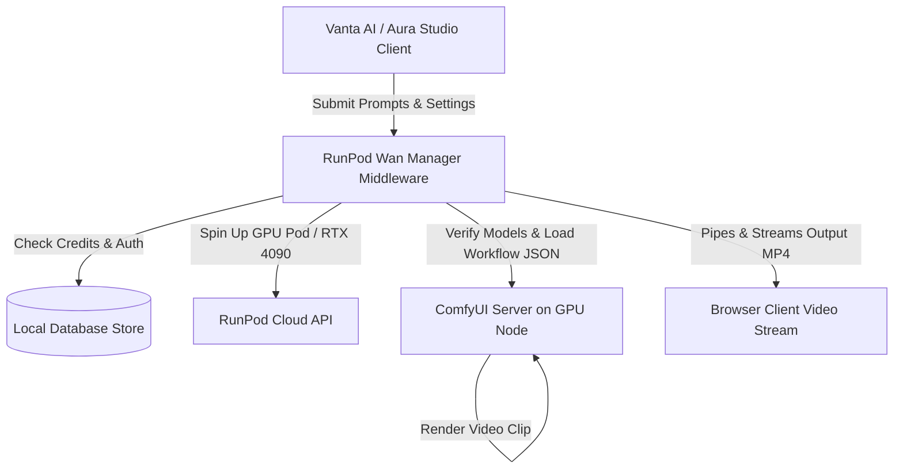

# ⚡ VANTA AI & AURA Studio: RunPod Wan Orchestration Suite

Welcome to the production-grade orchestration suite for high-fidelity AI video and image rendering. This repository links a sleek, dark-themed, glassmorphic React/Vite client frontend (Aura Studio / Vanta AI) with a robust, secure Node.js middleware server designed to spin up RunPod GPU nodes, control ComfyUI servers, and generate cinematic clips using the SOTA Wan2.2 video generation models.

---

## 🛠️ Architecture and System Flow

The orchestration flow behaves as a proxy middleware, securing your private credentials (such as your RunPod API Key) while exposing rate-limited endpoints for user generation requests.



---

## 🌟 Core Features

### 💻 Client Frontend (Aura Studio / Vanta AI)
* **Glassmorphic Console UI**: Built with modern typography, dark-mode styling, subtle micro-animations, and responsive grids.
* **Dual-Studio Modes**:
  * **Vanta AI**: A script-to-video workflow interface allowing paragraph-level text inputs to generate cinematic video sequences.
  * **Aura Studio**: A prompt-based generation workbench supporting aspect-ratio selection, inference-step tuning, and custom seeds.
* **Interactive Terminal Progress**: Shows real-time backend pipeline stages (GPU allocation, latent inference, texture mapping, export matrix) directly on the client.
* **Integrated Archive Workbench**: Allows remixing existing creations, checking parameters, and downloading generated video files.

### ⚙️ Orchestration Backend (RunPod Wan Manager)
* **GPU Compute Provisioning**: Programmatically resumes, monitors, and stops RunPod serverless/GPU container instances.
* **Automated Setup Scripts**: Includes built-in scripts to bootstrap Git LFS, ComfyUI, and selective downloaders for Wan2.2 models.
* **Secure Output Streaming Proxy**: Serves generated media files directly without exposing the private IP address of active ComfyUI pods.
* **Timing-Safe Auth & RBAC**: Timing-safe authorization token verification featuring multi-tenant scopes (`jobs:write`, `pod:read`, `keys:write`).
* **Abuse Protection**: Global rate limiting and automatic idle power-down watchdogs to save GPU running costs.

---

## ⚙️ Configuration Setup

### 1. Backend Orchestration Configuration
Create a `.env` file inside the `runpod-wan-manager` directory:
* `PORT`: Default local port (`3001`).
* `MANAGER_API_KEY`: Secret credential authorizing the client website to make generation calls.
* `RUNPOD_API_KEY`: Your private RunPod account key.
* `RUNPOD_POD_ID`: Your default target GPU pod instance.
* `RUNPOD_NETWORK_VOLUME_ID`: Network Volume ID to mount at `/workspace` for persisting model weights.
* `ENABLE_MOCK_RUNPOD`: Set to `true` for local mock testing without initiating active GPU billings.

### 2. Frontend Web Configuration
Create a `.env.local` file inside the `frontend` directory:
* `VITE_VANTA_API_BASE_URL`: Pointer to the manager backend (`http://localhost:3001`).
* `VITE_MANAGER_API_KEY`: Secret string matching the manager API key to authorize local browser requests.

---

## 🚀 Getting Started

Follow these steps to run the complete stack on your local environment:

### Step 1: Start the Backend Manager
Navigate to the backend directory, install the required node packages, and run the server in watch mode:
```bash
cd runpod-wan-manager
npm install
npm run dev
```

### Step 2: Start the Frontend App
Open a separate terminal window, navigate to the frontend directory, install dependencies, and launch the development client:
```bash
cd frontend
npm install
npm run dev
```
Open **[http://localhost:5173/](http://localhost:5173/)** in your browser to start generating!

---

## 🤝 Project Contribution
Feel free to fork the repository, open pull requests, and contribute to adding new workflow templates or supporting other GPU cloud providers. Built for creators and developers alike.
